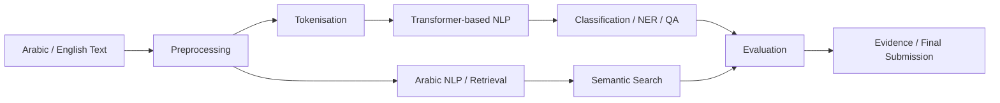

# Bayan — Bilingual Applied NLP Project

**Learner ID / GitHub username:** progHYA
**GitHub:** https://github.com/progHYA/Haya-Albaqami-SDAIA-NLP
**Final release:** `submission-v1.0`

## Executive summary | الملخص

**Bayan (بيان)** is a bilingual educational Natural Language Processing project developed using Transformer-based techniques. The project demonstrates a complete NLP workflow, starting from text preprocessing and tokenisation and progressing through Transformer concepts, text classification, Arabic NLP tasks, named entity recognition, question answering, semantic search, evaluation, and reproducibility testing.

The project is designed for **learning and demonstration purposes** within the SDAIA Academy Applied NLP training context. It demonstrates how NLP models can process Arabic and English text and produce structured outputs that can be evaluated. The project is not intended to represent a production-ready system, and its results should not be used for government, operational, or high-impact decisions without additional validation, larger evaluation datasets, security review, and human oversight.

## What Bayan does | ماذا يفعل بيان؟

1. **Privacy and preprocessing:** prepares text before modelling through cleaning, preprocessing, tokenisation, and handling of text inputs.
2. **Text classification:** demonstrates Transformer-based text classification and evaluation using classification metrics.
3. **NER:** works with named entity recognition data and evaluates entity/token alignment.
4. **Question answering:** demonstrates extractive question answering, including post-processing and handling of no-answer cases.
5. **Arabic NLP and semantic search:** processes Arabic text and demonstrates retrieval/search workflows using bilingual queries and text representations.
6. **Evaluation and reproducibility:** includes evaluation notebooks, error-analysis tests, retrieval tests, benchmarking/serving tests, and submission validation utilities.

The repository contains dedicated notebooks for text processing, attention and Transformers, and text classification, together with Arabic, NER, QA, retrieval, evaluation, and submission-testing materials.

## Scope and non-goals | النطاق وما لا يدعيه المشروع

* **In scope:** Arabic and English text processing, tokenisation, Transformer concepts, text classification, NER, extractive QA, Arabic NLP experimentation, semantic retrieval/search, evaluation, error analysis, and reproducibility.
* **Out of scope:** training a large language model from scratch, large-scale commercial deployment, production-grade multilingual infrastructure, or claiming state-of-the-art performance.
* **Not for production/government decisions without further validation:** the project is an educational prototype. Its outputs require additional validation, representative evaluation data, security testing, monitoring, and human review before being considered for real-world or high-impact use.

## Reproduce on Google Colab Free

|  # | Notebook / component           | Repository file                                                                       | Purpose |
| -: | ------------------------------ | ------------------------------------------------------------------------------------- | ------- |
| 01 | Text processing / tokenisation | `01_text_processing_tokenization.ipynb`                                               | Gate A  |
| 02 | Attention / Transformers       | `02_attention_transformers.ipynb`                                                     | LO2     |
| 03 | Text classification            | `03_text_classification.ipynb`                                                        | Gate B  |
| 04 | NER / QA                       | `bayan_day2_ner.jsonl`, `bayan_day2_qa.json`                                          | Gate B  |
| 05 | Arabic NLP                     | `bayan_day3_arabic.csv`                                                               | Gate C  |
| 06 | Semantic search / retrieval    | `bayan_day3_queries.jsonl`, `bayan_day3_cases.csv`                                    | Gate C  |
| 07 | Evaluation / error analysis    | `bayan_day3_predictions.csv`, `test_day3_error_analysis.py`, `test_day3_retrieval.py` | Gate C  |
| 08 | Optimisation / serving         | `test_day4_benchmarking.py`, `test_day4_serving.py`                                   | Gate D  |

**Note:** The current repository does not contain a separate notebook named `00_runtime_doctor.ipynb` or separate notebooks numbered 04–08. The later stages are represented by datasets, scripts, tests, and project files rather than by the exact notebook structure in the original template.

### Clean-run instructions

1. Open the relevant notebook in Google Colab.
2. Choose **Save a copy in Drive**.
3. Run the notebooks/components in numerical order.
4. Restart the Colab runtime and run the notebook again before capturing final evidence.
5. Do not place API tokens, passwords, PII, private Drive links, or private credentials in the repository.

## Architecture



## Results | النتائج

All numerical results should be reported only when they have been measured and documented in the repository.

| Component             | Metric              | Result + label                        | Split/workload                  | Evidence                                       |
| --------------------- | ------------------- | ------------------------------------- | ------------------------------- | ---------------------------------------------- |
| Text classification   | Macro-F1            | **To be populated from measured run** | Classification evaluation split | `03_text_classification.ipynb`                 |
| NER                   | Entity F1           | **To be populated from measured run** | NER evaluation data             | `bayan_day2_ner.jsonl` + NER tests             |
| QA                    | EM / F1 / no-answer | **To be populated from measured run** | QA evaluation data              | `bayan_day2_qa.json` + QA tests                |
| Semantic search       | Recall@k / MRR      | **To be populated from measured run** | Retrieval/query cases           | `bayan_day3_queries.jsonl` + retrieval tests   |
| Serving               | p95 / throughput    | **To be populated from measured run** | Serving benchmark               | `test_day4_benchmarking.py`                    |
| Submission validation | Validator status    | **To be populated from final run**    | Repository submission           | `test_day4_submission.py`, `test_preflight.py` |

**Important:** No unmeasured performance number is presented as a project result. This avoids confusing a target or reference value with an actual measured result.

## Error found and decision | خطأ وقرار

* **Observed failure:** During development, NLP workflows required validation of preprocessing, tokenisation, classification metrics, NER alignment, QA post-processing, retrieval, and serving behaviour.
* **Slice/taxonomy:** The project therefore separates errors by task, including classification/metric issues, NER token alignment, QA post-processing, Arabic profiles, retrieval behaviour, and serving/benchmarking.
* **Fix or deferred action:** Task-specific automated tests were included in the repository to validate these stages rather than relying only on visual notebook output.
* **Evidence after change:** `test_day1_preprocessing.py`, `test_day1_tokenization.py`, `test_day2_metrics.py`, `test_day2_ner_alignment.py`, `test_day2_qa_postprocess.py`, `test_day3_error_analysis.py`, `test_day3_retrieval.py`, `test_day4_benchmarking.py`, and `test_day4_serving.py`.

## Measured extension | الامتداد المقاس

* **Extension chosen:** Extend the basic NLP exercises into a broader bilingual project structure covering Arabic NLP, NER, QA, retrieval, evaluation, and reproducibility.
* **Baseline:** The baseline is the individual NLP learning workflow demonstrated through preprocessing, Transformer concepts, and text classification.
* **Benefit/cost metric:** Task-specific evaluation metrics and reproducibility/benchmarking tests are used where applicable. Numerical improvements are reported only after an actual measured comparison.
* **Evidence path:** `bayan_day2_classification.csv`, `bayan_day2_ner.jsonl`, `bayan_day2_qa.json`, `bayan_day3_arabic.csv`, `bayan_day3_cases.csv`, `bayan_day3_predictions.csv`, `bayan_day3_queries.jsonl`, and the corresponding test files.
* **Decision and limitation:** The extension demonstrates a wider NLP workflow, but it remains an educational prototype and does not establish production-level performance.

## Repository evidence

The repository currently contains:

* `DATA_CARD_TEMPLATE.md`
* `MODEL_CARD_TEMPLATE.md`
* `BENCHMARKS_TEMPLATE.md`
* `DECISIONS_TEMPLATE.md`
* `EVALUATION_REPORT_TEMPLATE.md`
* `PROGRESS_TEMPLATE.md`
* `PROJECT_SUMMARY.template.json`
* `SUBMISSION.yml`
* `architecture.png`
* `bayan_day1_sample.csv`
* `bayan_day2_classification.csv`
* `bayan_day2_ner.jsonl`
* `bayan_day2_qa.json`
* `bayan_day3_arabic.csv`
* `bayan_day3_cases.csv`
* `bayan_day3_predictions.csv`
* `bayan_day3_queries.jsonl`
* automated test files for Days 1–4.

## Limitations and responsible use

* **Data limitation:** The project uses educational datasets and project-specific sample data; these should not be assumed to represent the full diversity of Arabic or English language use.
* **Arabic/dialect/Arabizi limitation:** Arabic NLP performance can vary considerably across Modern Standard Arabic, Saudi and other dialects, informal writing, spelling variation, and Arabizi. The project should not be interpreted as comprehensive Arabic-language coverage.
* **Task/model limitation:** Different NLP tasks require different model architectures, preprocessing, labels, and evaluation methods. Performance on one task does not establish performance on another.
* **Evaluation uncertainty:** Small or educational evaluation datasets may not provide sufficient evidence for generalisation to unseen real-world populations.
* **Serving/security limitation:** Repository-level serving and benchmarking tests do not by themselves establish production security, scalability, privacy compliance, or operational reliability.
* **Human review requirement:** Outputs should be reviewed by a human before being used in high-impact, sensitive, governmental, or operational contexts.

## Final validation

```bash
PYTHONPATH=src python scripts/validate_submission.py . --require-tag
PYTHONPATH=src python scripts/preflight_submission.py . --require-tag
```

* **Validator status:** To be recorded after the final validation commands are executed.
* **CI badge/link:** No verified CI result is claimed here unless a successful workflow is present in the repository.
* **Release `submission-v1.0`:** Final submission tag specified in `SUBMISSION.yml`.

## Presentation | العرض

See the project notebooks and repository evidence files for implementation examples and results.

**FILL_ME removed:** Add `PRESENTATION.md` only if a separate presentation is actually included in the final submission.

## My contribution | مساهمتي

* **My change and files:** Developed and organised the Bayan NLP project repository, including the NLP notebooks, task-specific datasets, Arabic NLP materials, retrieval/evaluation materials, documentation templates, and automated validation/testing files.
* **Reason and evidence:** The repository contains the implementation notebooks, datasets, architecture material, and task-specific test files used to demonstrate and validate the project workflow.

## AI assistance | الاستعانة بالأدوات

AI assistance was used during the development and documentation process to support code troubleshooting, explanation, structuring, and documentation. Final project code, outputs, repository contents, and claims should be reviewed and verified by the learner before submission.

Third-party libraries, models, datasets, and educational materials remain subject to their respective licenses and attribution requirements.

## Training context | السياق التدريبي

This educational project was developed during Applied Natural Language Processing
with Transformers (SDA-AIE-211) in the SDAIA Academy training context.

أُنجز هذا المشروع التعليمي ضمن دورة معالجة اللغات الطبيعية باستخدام المحولات
(SDA-AIE-211) في السياق التدريبي لأكاديمية سدايا.

Academy | الأكاديمية: [SDAIA Academy](https://github.com/SDAIAAcademy)
Trainer | المدربة: Meaad Al-Marri — ميعاد المري
Course source: https://github.com/almiyead-rgb/bayan-applied-nlp-course

#SDAIAAcademy

This attribution does not claim Academy endorsement or ownership of third-party assets.

لا يدعي هذا النسب اعتماد المشروع أو تملك أصول الأطراف الأخرى.

## Final hand-in acknowledgement | إقرار التسليم النهائي

I confirm that I reviewed the project requirements and that this repository represents my final submission for **Bayan**.

I understand that the submitted version is intended to be evaluated as the final version and that the final submission tag is:

`submission-v1.0`

## License and acknowledgements

The project uses open-source Python/NLP libraries, Transformer-based technologies, and educational datasets/materials. Each third-party library, model, dataset, and source remains subject to its own license and attribution requirements.

No ownership of third-party models, datasets, libraries, institutional names, logos, or trademarks is claimed.

Third-party and training references include the SDAIA Academy training context and the Applied NLP course materials:

* SDAIA Academy: https://github.com/SDAIAAcademy
* Course source: https://github.com/almiyead-rgb/bayan-applied-nlp-course

The project is an independent educational submission and does not claim institutional endorsement.
